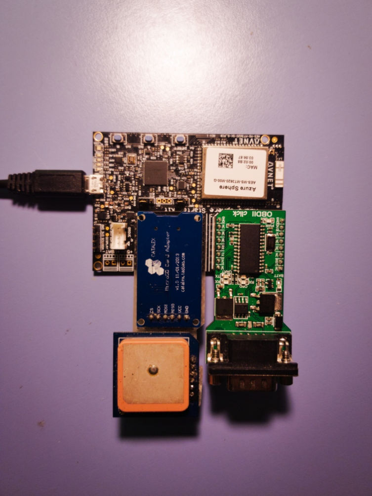
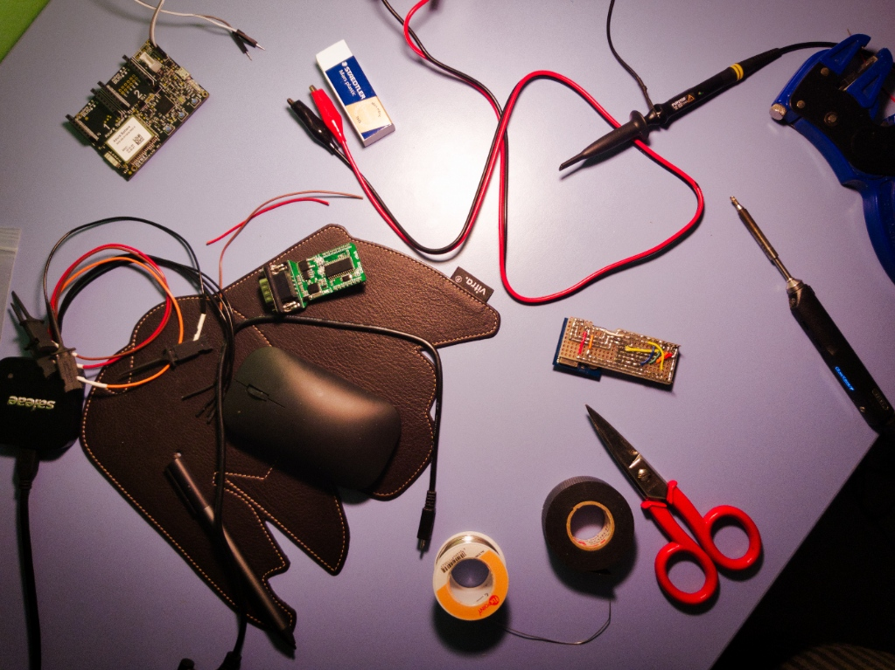
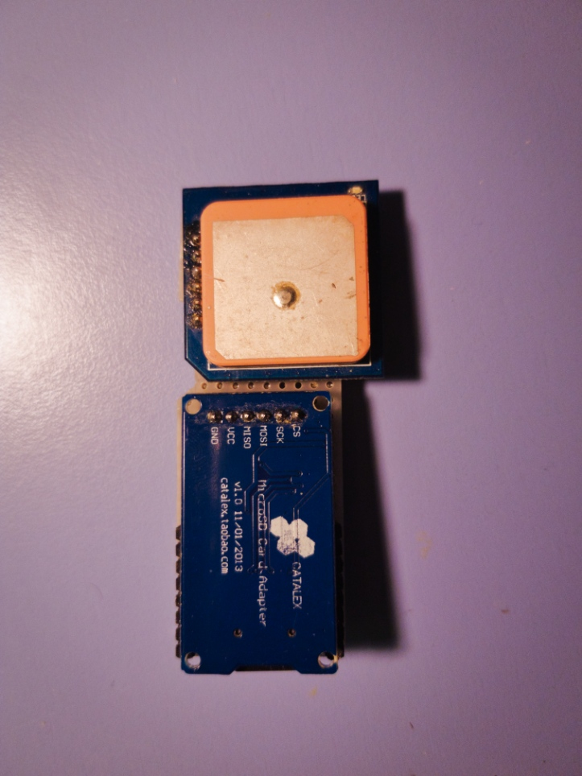
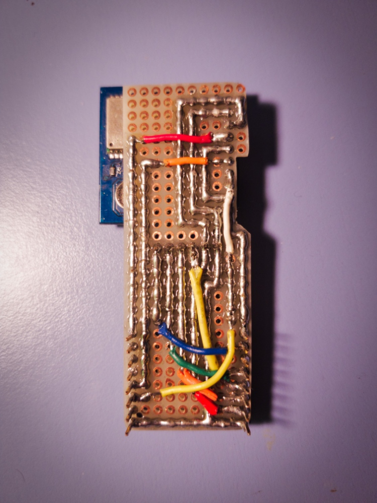

# The logging device

This device is built using an Azure Sphere compatible board. We suggest to use an Avnet Azure Sphere Starter Kit because it already has two mikroBUS™ slots.

## Materials

In order to build this device, you'll need:

- An [Avnet Azure Sphere Starter Kit](http://cloudconnectkits.org/product/azure-sphere-starter-kit),
- An [OBDII click](https://www.mikroe.com/obdii-click) (in mikroBUS™ slot 1),
- An [OBDII to DB9 cable](https://www.mikroe.com/obd-ii-to-db9-cable),
- A **NMEA-compliant** GPS module (e.g. ublox NEO-M8N),
- A microSD card reader (possibly without level shifters),
- A microSD with a **FAT** or **exFAT** filesystem (preferably <2GB in size).

For the custom click:

- Perfboard,
- Wires,
- Soldering material,
- Strip headers.

## Custom click for microSD and GPS

Given the possibility to have two clicks connected at the same time (although with some pins shared), I chose to connect the GPS and the microSD card reader to the second mikroBUS™ slot.\
To achieve this, I built a small adapter on a piece of perfboard.

|    Front    |     Back      |
|:-----------:|:-------------:|
|  |  |

### Connection issues

Even though the MT3620 chip has four or more ISU interfaces, which are generic and configurable serial interfaces (UART, IIC, SPI), only three of them are exposed on this kit and have fixed configurations.

- ISU0 is configured as UART and has no internal devices connected.
- The same can be said for the second one (ISU1, SPI).
- ISU2 is configured as an IIC bus and has some on-board devices already connected (gyro-accelerometer, temperature sensor and barometer, also exposed on the Grove and OLED display connectors), so changing its purpose may not be a great idea.

Remember that the two mikroBUS™ slots share the same ISU interfaces (but have different GPIO pins and SPI CS lines).

We have some other devices to interface with:

- The OBDII click (UART),
- The microSD card (SPI),
- The GPS (UART),
- The GPS module's compass (IIC, optional).

We have no issues with the microSD card because the SPI bus is free, same with the compass since IIC is address-based.

On the other hand, we have some issues with the UART conflict. One of the two UART devices will be used in bit-banged mode.\
Personally, I prefer to have the GPS used this way, since we need almost no data transmission and slow speeds are acceptable (less than 9600 baud @ 1Hz update rate). The OBDII adapter needs a more reliable and duplex communication, with speeds up to 20Mbaud (even if we'll never reach such speeds).

### Voltage considerations

The kit works at 3.3V and **does not tolerate 5V on its I/Os**. It is fully compatible with the OBDII adapter, but some GPS and microSD modules may complain.

- Some GPS modules might not power up/have tracking issues when powered at 3.3V. Please check this before buying or use a 5V module with level shifters.
- Many SD/microSD reader modules have on-board level shifters. Since SD cards work at 3.3V, you won't need to shift anything. Just buy simple readers with no level translators. If you only have readers with integrated shifters (like I do), check them before and always power them at 3.3V (you don't want them to answer back at 5V). From what I have tested, Pololu ones did not work at 3.3V, while CATALEX-branded ones did (check the regulator and the shifters' datasheets).

### Connections

This table refers to the second slot.

|   mikroBUS™ pin name   |    GPIO number    |   Device   |    Device pin name    |    Notes    |
|:---------------------:|:-----------------:|:----------:|:---------------------:|:-----------:|
|          AN           |    GPIO43/ADC2    |    GPS     |          RX           |Bitbanged TX |
|         RST           |       GPIO17      |     SD     |          CS           |Bitbanged CS*|
|          CS           |    GPIO35/CSB1    |            |      Disconnected     |             |
|         SCK           | GPIO31/SCLK1/TXD1 |     SD     |          SCK          |             |
|         SDI           |GPIO33/MISO1/RXD1/DATA1| SD     | MISO |   Might need ~100k pull-up   |
|         SDO           |GPIO32/MOSI1/RTS1/CLK1|  SD     |         MOSI          |             |
|         3V3           |                   |    Both    |          VCC          |             |
|         GND           |                   |    Both    |          GND          |             |
|         PWM           |   GPIO1/PWM1      |    GPS     |          TX           |Bitbanged RX |
|         INT           |   GPIO2/PWM2      |            |      Disconnected     | Used by OBD |
|          RX           |GPIO28/MISO0/RX0/DATA0|         |      Disconnected     | Used by OBD |
|          TX           | GPIO26/SCLK0/TX0  |            |      Disconnected     | Used by OBD |
|         SCL           |GPIO37/MOSI2/RTS2/SCL2| GPS     |          SCL          |             |
|         SDA           |GPIO38/MISO2/RXD2/SDA2| GPS     |          SDA          |             |
|          5V           |                   |            |    **Disconnected**   |             |
|         GND           |                   |    Both    |          GND          |             |

\* The CS pin of the microSD card reader is left disconnected from the ISU's CS pin because it needs to be handled in a particular way. microSD cards sometimes need to receive data with CS high and since the internal APIs don't allow this, it is preferred to control it manually (as of now, even the SPI bus is also bit-banged, but I plan to switch to a faster implementation in the future).